```{r, include = FALSE}
knitr::opts_chunk$set(
  collapse = TRUE,
  comment = "#>",
  echo = FALSE,
  message = FALSE,
  warning = FALSE,
  fig.align = "left",
  fig.retina = 2, 
  out.width = "90%",
  knitr.table.format = "html"
)

library(tidyverse)

variables <- read_csv("data/variables.csv")
```

```{css}
img {
  border: 0;
}
```

This vignette presents all of the tables needed in a CRVS report. The variables required for each table are shown alongside a template for each table. The table templates derive from the Vital Strategies' [Production of a Vital Statistics Report: Template](https://www.vitalstrategies.org/resources/production-of-a-vital-statistics-report). 

## Quality, timeliness and completeness

### Table 3.1 
*Number of vital events by registration timeliness, year*    
<br>
Variables required:

```{r, results='asis'}
bullets <- variables |> 
  filter(id == "table_3_01") |> 
  distinct(variable_id, .keep_all = TRUE) |> 
  mutate(text = str_glue("{variable_id} ({variable_name}, {characteristic})")) |> 
  pull(text)
cat(paste('-', bullets), sep = '\n')
```

<br>
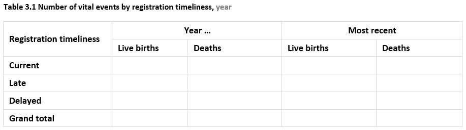{fig-alt="Template for Table 3.1." width=80% fig-align="left"}

---


### Table 3.2 
*Proportion (%) of births by year of registration and year of occurrence*   
<br>
Variables required:

```{r, results='asis'}
bullets <- variables |> 
  filter(id == "table_3_02") |> 
  distinct(variable_id, .keep_all = TRUE) |> 
  mutate(text = str_glue("{variable_id} ({variable_name}, {characteristic})")) |> 
  pull(text)
cat(paste('-', bullets), sep = '\n')
```

<br>
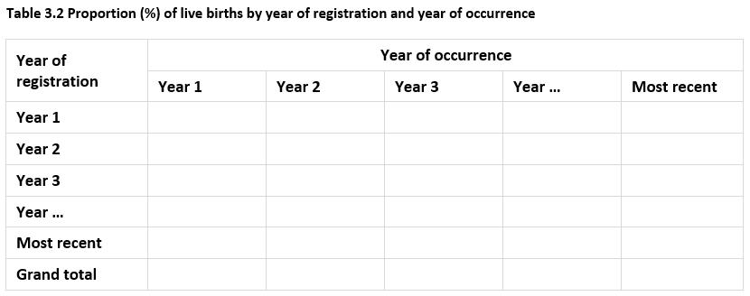{fig-alt="Template for Table 3.2." width=80% fig-align="left"}

---


### Table 3.3 
*Proportion (%) of deaths by year of registration and year of occurrence*   
<br>
Variables required:

```{r, results='asis'}
bullets <- variables |> 
  filter(id == "table_3_03") |> 
  distinct(variable_id, .keep_all = TRUE) |> 
  mutate(text = str_glue("{variable_id} ({variable_name}, {characteristic})")) |> 
  pull(text)
cat(paste('-', bullets), sep = '\n')
```

<br>
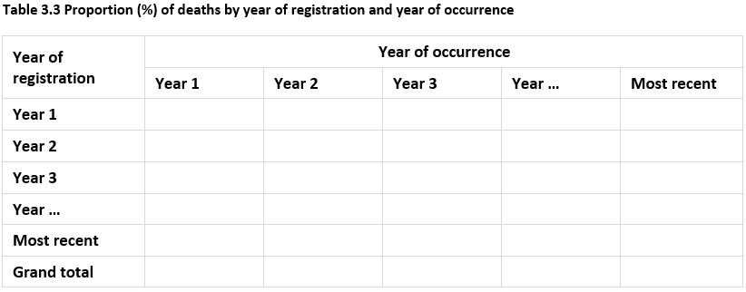{fig-alt="Template for Table 3.3." width=80% fig-align="left"}

---


### Table 3.4 
*Birth registration completeness by year of occurrence and sex of newborn*  
<br>
Variables required:

```{r, results='asis'}
bullets <- variables |> 
  filter(id == "table_3_04") |> 
  distinct(variable_id, .keep_all = TRUE) |> 
  mutate(text = str_glue("{variable_id} ({variable_name}, {characteristic})")) |> 
  pull(text)
cat(paste('-', bullets), sep = '\n')
```

<br>
{fig-alt="Template for Table 3.4." width=80% fig-align="left"}

---


### Table 3.5 
*Birth registration completeness by place of usual residence of mother and sex of newborn, year*    
<br>
Variables required:

```{r, results='asis'}
bullets <- variables |> 
  filter(id == "table_3_05") |> 
  distinct(variable_id, .keep_all = TRUE) |> 
  mutate(text = str_glue("{variable_id} ({variable_name}, {characteristic})")) |> 
  pull(text)
cat(paste('-', bullets), sep = '\n')
```

<br>
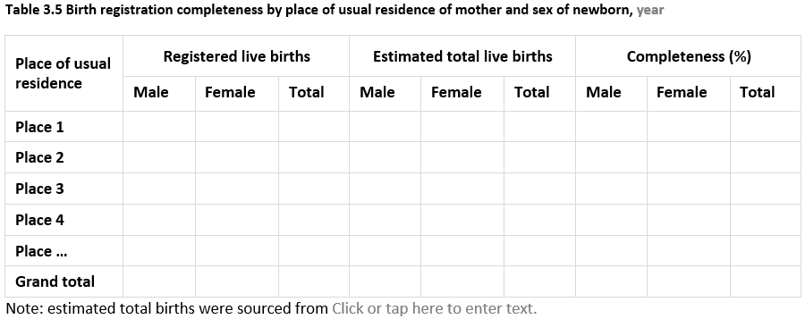{fig-alt="Template for Table 3.5." width=80% fig-align="left"}

---


### Table 3.6 
*Death registration completeness by year of occurrence and sex of decedent*    
<br>
Variables required:

```{r, results='asis'}
bullets <- variables |> 
  filter(id == "table_3_06") |> 
  distinct(variable_id, .keep_all = TRUE) |> 
  mutate(text = str_glue("{variable_id} ({variable_name}, {characteristic})")) |> 
  pull(text)
cat(paste('-', bullets), sep = '\n')
```

<br>
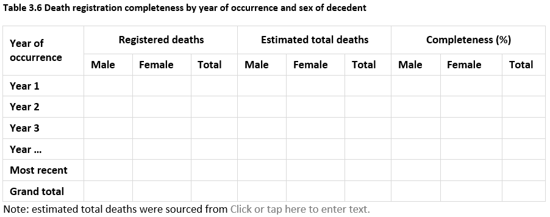{fig-alt="Template for Table 3.6." width=80% fig-align="left"}

---


### Table 3.7 
*Death registration completeness by place of usual residence and sex of decedent, year*    
<br>
Variables required:

```{r, results='asis'}
bullets <- variables |> 
  filter(id == "table_3_07") |> 
  distinct(variable_id, .keep_all = TRUE) |> 
  mutate(text = str_glue("{variable_id} ({variable_name}, {characteristic})")) |> 
  pull(text)
cat(paste('-', bullets), sep = '\n')
```

<br>
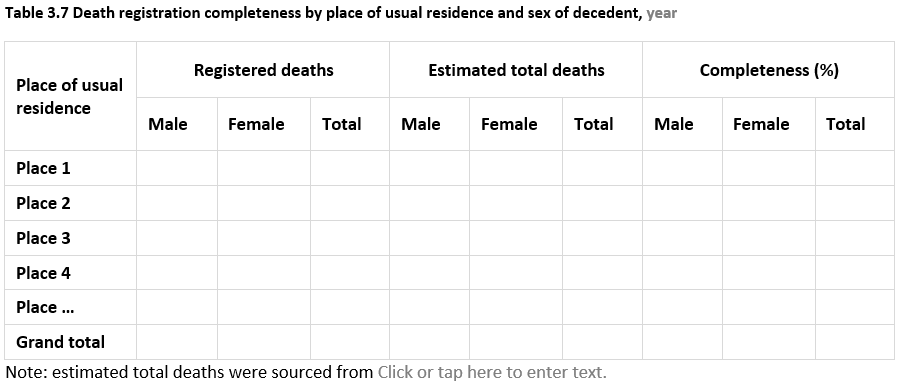{fig-alt="Template for Table 3.7." width=80% fig-align="left"}

---


### Table 3.8 
*Adjustment of births by place of usual residence of mother and sex of newborn, year*    
<br>
Variables required:

```{r, results='asis'}
bullets <- variables |> 
  filter(id == "table_3_08") |> 
  distinct(variable_id, .keep_all = TRUE) |> 
  mutate(text = str_glue("{variable_id} ({variable_name}, {characteristic})")) |> 
  pull(text)
cat(paste('-', bullets), sep = '\n')
```

<br>
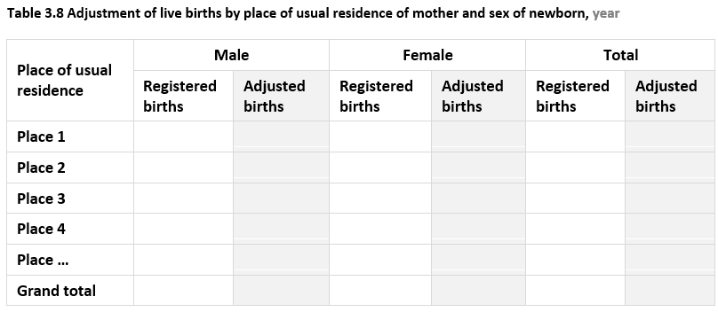{fig-alt="Template for Table 3.8." width=80% fig-align="left"}

---


### Table 3.9 
*Adjustment of deaths by place of usual residence and sex of decedent, year*     
<br>
Variables required:

```{r, results='asis'}
bullets <- variables |> 
  filter(id == "table_3_09") |> 
  distinct(variable_id, .keep_all = TRUE) |> 
  mutate(text = str_glue("{variable_id} ({variable_name}, {characteristic})")) |> 
  pull(text)
cat(paste('-', bullets), sep = '\n')
```

<br>
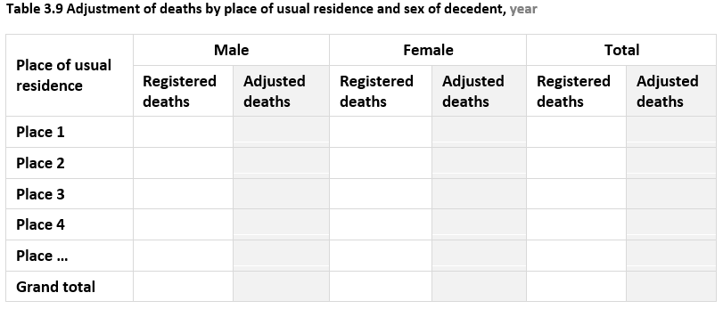{fig-alt="Template for Table 3.9." width=80% fig-align="left"}

---


### Table 3.10 
*Adjustment of deaths by age group and sex of decedent, year*    
<br>
Variables required:

```{r, results='asis'}
bullets <- variables |> 
  filter(id == "table_3_10") |> 
  distinct(variable_id, .keep_all = TRUE) |> 
  mutate(text = str_glue("{variable_id} ({variable_name}, {characteristic})")) |> 
  pull(text)
cat(paste('-', bullets), sep = '\n')
```

<br>
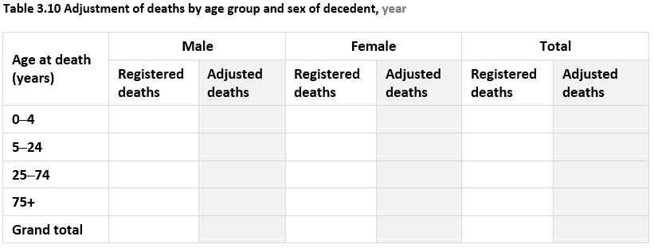{fig-alt="Template for Table 3.10." width=80% fig-align="left"}

---


### Table 3.11 
*Redistribution of births with incomplete data on ‘age of mother’, year*    
<br>
Variables required:

```{r, results='asis'}
bullets <- variables |> 
  filter(id == "table_3_11") |> 
  distinct(variable_id, .keep_all = TRUE) |> 
  mutate(text = str_glue("{variable_id} ({variable_name}, {characteristic})")) |> 
  pull(text)
cat(paste('-', bullets), sep = '\n')
```

<br>
{fig-alt="Template for Table 3.11." width=80% fig-align="left"}

---


### Table 3.12 
*Redistribution of deaths with incomplete data on ‘age of decedent’, year*    
<br>
Variables required:

```{r, results='asis'}
bullets <- variables |> 
  filter(id == "table_3_12") |> 
  distinct(variable_id, .keep_all = TRUE) |> 
  mutate(text = str_glue("{variable_id} ({variable_name}, {characteristic})")) |> 
  pull(text)
cat(paste('-', bullets), sep = '\n')
```

<br>
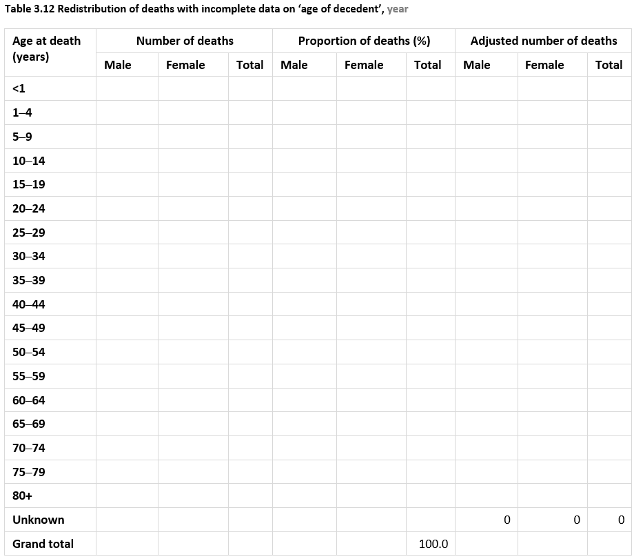{fig-alt="Template for Table 3.12." width=80% fig-align="left"}

---


## Births

### Table 4.1 
*Summary statistics on fertility by year of occurrence*    
<br>
Variables required:

```{r, results='asis'}
bullets <- variables |> 
  filter(id == "table_4_01") |> 
  distinct(variable_id, .keep_all = TRUE) |> 
  mutate(text = str_glue("{variable_id} ({variable_name}, {characteristic})")) |> 
  pull(text)
cat(paste('-', bullets), sep = '\n')
```

<br>
{fig-alt="Template for Table 4.1." width=80% fig-align="left"}

---


### Table 4.2 
*Live births by place of occurrence and sex of newborn, year*    
<br>
Variables required:

```{r, results='asis'}
bullets <- variables |> 
  filter(id == "table_4_02") |> 
  distinct(variable_id, .keep_all = TRUE) |> 
  mutate(text = str_glue("{variable_id} ({variable_name}, {characteristic})")) |> 
  pull(text)
cat(paste('-', bullets), sep = '\n')
```

<br>
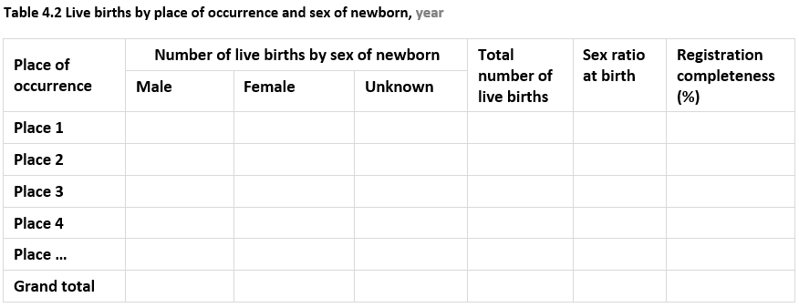{fig-alt="Template for Table 4.2." width=80% fig-align="left"}

---


### Table 4.3 
*Live births by place of occurrence and place of usual residence of mother, year*    
<br>
Variables required:

```{r, results='asis'}
bullets <- variables |> 
  filter(id == "table_4_03") |> 
  distinct(variable_id, .keep_all = TRUE) |> 
  mutate(text = str_glue("{variable_id} ({variable_name}, {characteristic})")) |> 
  pull(text)
cat(paste('-', bullets), sep = '\n')
```

<br>
{fig-alt="Template for Table 4.3." width=80% fig-align="left"}

---


### Table 4.4 
*Live births by age of mother and type of birth, year*    
<br>
Variables required:

```{r, results='asis'}
bullets <- variables |> 
  filter(id == "table_4_04") |> 
  distinct(variable_id, .keep_all = TRUE) |> 
  mutate(text = str_glue("{variable_id} ({variable_name}, {characteristic})")) |> 
  pull(text)
cat(paste('-', bullets), sep = '\n')
```

<br>
{fig-alt="Template for Table 4.4." width=80% fig-align="left"}

---


### Table 4.5 
*Live births by age and marital status of mother, urban areas, year*    
<br>
Variables required:

```{r, results='asis'}
bullets <- variables |> 
  filter(id == "table_4_05") |> 
  distinct(variable_id, .keep_all = TRUE) |> 
  mutate(text = str_glue("{variable_id} ({variable_name}, {characteristic})")) |> 
  pull(text)
cat(paste('-', bullets), sep = '\n')
```

<br>
{fig-alt="Template for Table 4.5." width=80% fig-align="left"}

---


### Table 4.6 
*Live births by age and marital status of mother, rural areas, year*    
<br>
Variables required:

```{r, results='asis'}
bullets <- variables |> 
  filter(id == "table_4_06") |> 
  distinct(variable_id, .keep_all = TRUE) |> 
  mutate(text = str_glue("{variable_id} ({variable_name}, {characteristic})")) |> 
  pull(text)
cat(paste('-', bullets), sep = '\n')
```

<br>
{fig-alt="Template for Table 4.6." width=80% fig-align="left"}

---


### Table 4.7 
*Live births by place of occurrence, site of delivery and attendant at birth, year*    
<br>
Variables required:

```{r, results='asis'}
bullets <- variables |> 
  filter(id == "table_4_07") |> 
  distinct(variable_id, .keep_all = TRUE) |> 
  mutate(text = str_glue("{variable_id} ({variable_name}, {characteristic})")) |> 
  pull(text)
cat(paste('-', bullets), sep = '\n')
```

<br>
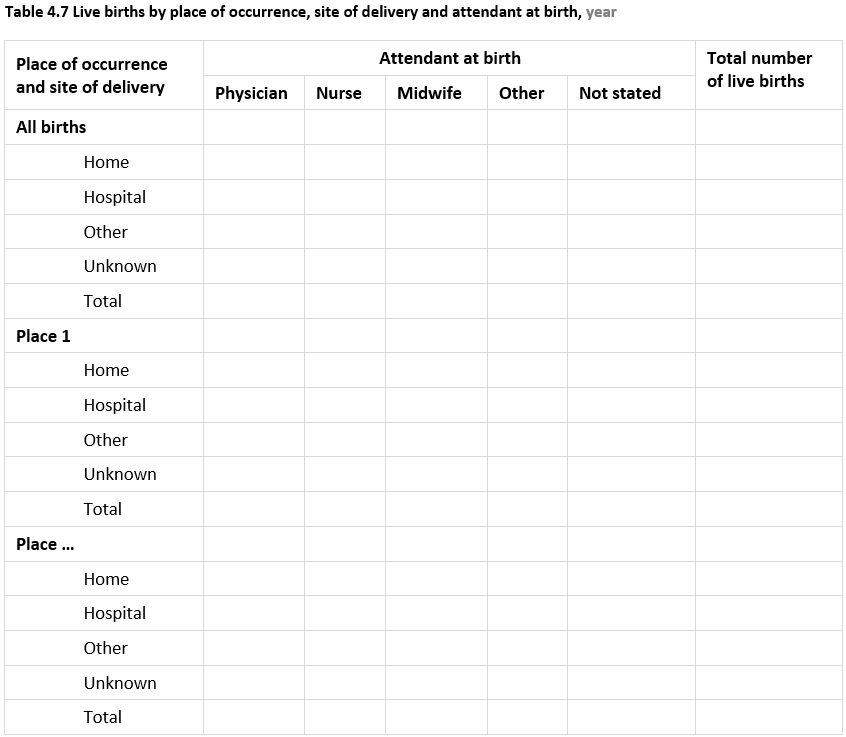{fig-alt="Template for Table 4.7." width=80% fig-align="left"}

---


### Table 4.8 
*Crude birth rate (CBR) by place of usual residence of mother, year*    
<br>
Variables required:

```{r, results='asis'}
bullets <- variables |> 
  filter(id == "table_4_08") |> 
  distinct(variable_id, .keep_all = TRUE) |> 
  mutate(text = str_glue("{variable_id} ({variable_name}, {characteristic})")) |> 
  pull(text)
cat(paste('-', bullets), sep = '\n')
```

<br>
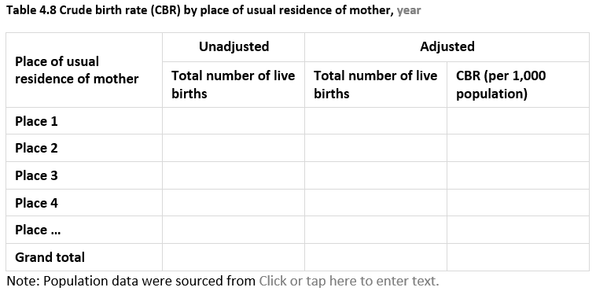{fig-alt="Template for Table 4.8." width=80% fig-align="left"}

---


### Table 4.9 
*Age-specific fertility rates by usual residence of mother, urban areas, year*    
<br>
Variables required:

```{r, results='asis'}
bullets <- variables |> 
  filter(id == "table_4_09") |> 
  distinct(variable_id, .keep_all = TRUE) |> 
  mutate(text = str_glue("{variable_id} ({variable_name}, {characteristic})")) |> 
  pull(text)
cat(paste('-', bullets), sep = '\n')
```

<br>
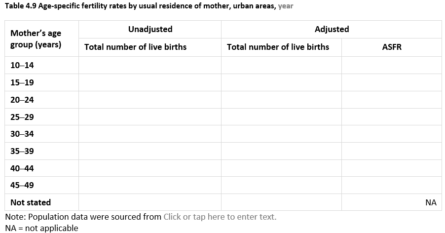{fig-alt="Template for Table 4.9." width=80% fig-align="left"}

---


### Table 4.10 
*Age-specific fertility rates by usual residence of mother, rural areas, year*    
<br>
Variables required:

```{r, results='asis'}
bullets <- variables |> 
  filter(id == "table_4_10") |> 
  distinct(variable_id, .keep_all = TRUE) |> 
  mutate(text = str_glue("{variable_id} ({variable_name}, {characteristic})")) |> 
  pull(text)
cat(paste('-', bullets), sep = '\n')
```

<br>
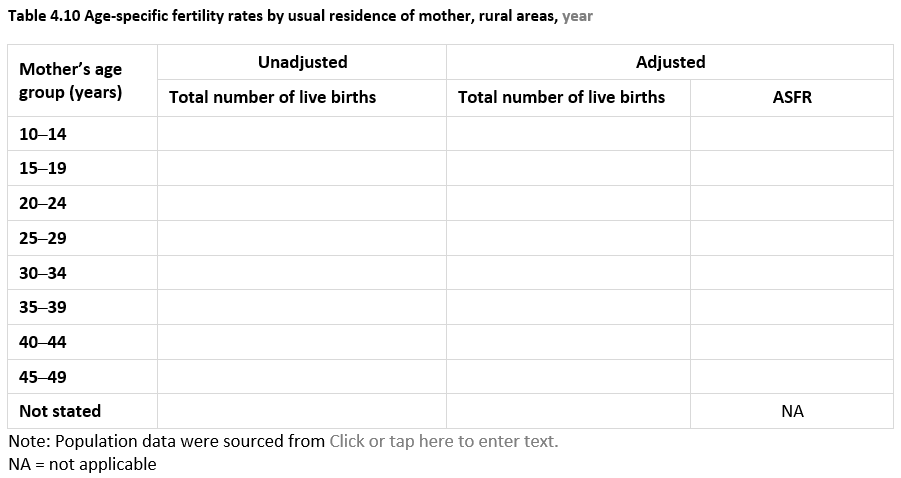{fig-alt="Template for Table 4.10." width=80% fig-align="left"}

---


### Table 4.11
*Total fertility rate (TFR) by usual residence of mother, year*     
<br>
Variables required:

```{r, results='asis'}
bullets <- variables |> 
  filter(id == "table_4_11") |> 
  distinct(variable_id, .keep_all = TRUE) |> 
  mutate(text = str_glue("{variable_id} ({variable_name}, {characteristic})")) |> 
  pull(text)
cat(paste('-', bullets), sep = '\n')
```

<br>
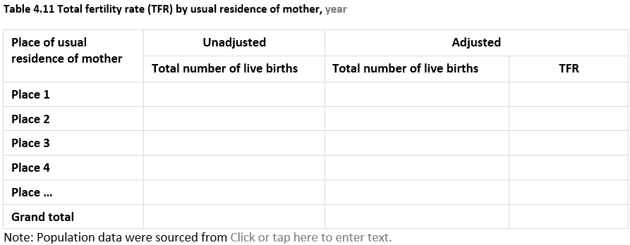{fig-alt="Template for Table 4.11." width=80% fig-align="left"}

---


## Deaths

### Table 5.1 
*Summary statistics on mortality by year of occurrence*     
<br>
Variables required:

```{r, results='asis'}
bullets <- variables |> 
  filter(id == "table_5_01") |> 
  distinct(variable_id, .keep_all = TRUE) |> 
  mutate(text = str_glue("{variable_id} ({variable_name}, {characteristic})")) |> 
  pull(text)
cat(paste('-', bullets), sep = '\n')
```

<br>
{fig-alt="Template for Table 5.1." width=80% fig-align="left"}

---


### Table 5.2 
*Deaths by place of usual residence and sex of decedent, year*    
<br>
Variables required:

```{r, results='asis'}
bullets <- variables |> 
  filter(id == "table_5_02") |> 
  distinct(variable_id, .keep_all = TRUE) |> 
  mutate(text = str_glue("{variable_id} ({variable_name}, {characteristic})")) |> 
  pull(text)
cat(paste('-', bullets), sep = '\n')
```

<br>
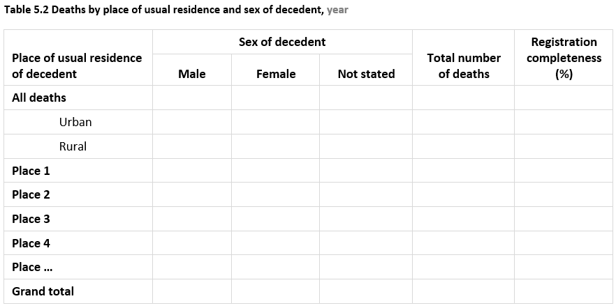{fig-alt="Template for Table 5.2." width=80% fig-align="left"}

---


### Table 5.3 
*Deaths by place of occurrence and place of usual residence of decedent, males, year*    
<br>
Variables required:

```{r, results='asis'}
bullets <- variables |> 
  filter(id == "table_5_03") |> 
  distinct(variable_id, .keep_all = TRUE) |> 
  mutate(text = str_glue("{variable_id} ({variable_name}, {characteristic})")) |> 
  pull(text)
cat(paste('-', bullets), sep = '\n')
```

<br>
{fig-alt="Template for Table 5.3." width=80% fig-align="left"}

---


### Table 5.4 
*Deaths by place of occurrence and place of usual residence of decedent, females, year*    
<br>
Variables required:

```{r, results='asis'}
bullets <- variables |> 
  filter(id == "table_5_04") |> 
  distinct(variable_id, .keep_all = TRUE) |> 
  mutate(text = str_glue("{variable_id} ({variable_name}, {characteristic})")) |> 
  pull(text)
cat(paste('-', bullets), sep = '\n')
```

<br>
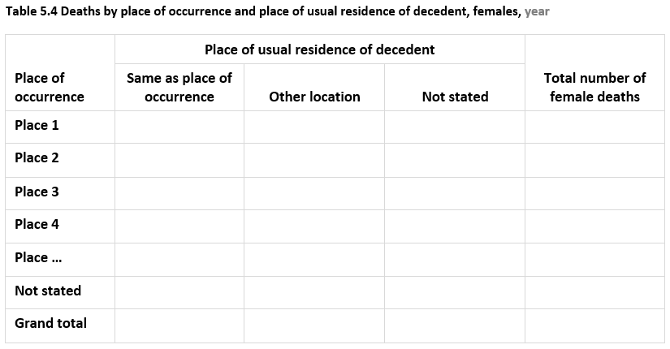{fig-alt="Template for Table 5.4." width=80% fig-align="left"}

---


### Table 5.5 
*Deaths by place of occurrence and site of occurrence, year*    
<br>
Variables required:

```{r, results='asis'}
bullets <- variables |> 
  filter(id == "table_5_05") |> 
  distinct(variable_id, .keep_all = TRUE) |> 
  mutate(text = str_glue("{variable_id} ({variable_name}, {characteristic})")) |> 
  pull(text)
cat(paste('-', bullets), sep = '\n')
```

<br>
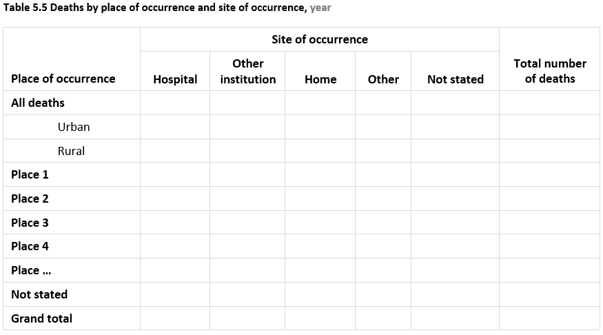{fig-alt="Template for Table 5.5." width=80% fig-align="left"}

---


### Table 5.6 
*Deaths by age and sex of decedent, urban areas, year*    
<br>
Variables required:

```{r, results='asis'}
bullets <- variables |> 
  filter(id == "table_5_06") |> 
  distinct(variable_id, .keep_all = TRUE) |> 
  mutate(text = str_glue("{variable_id} ({variable_name}, {characteristic})")) |> 
  pull(text)
cat(paste('-', bullets), sep = '\n')
```

<br>
{fig-alt="Template for Table 5.6." width=80% fig-align="left"}

---


### Table 5.7 
*Deaths by age and sex of decedent, rural areas, year*    
<br>
Variables required:

```{r, results='asis'}
bullets <- variables |> 
  filter(id == "table_5_07") |> 
  distinct(variable_id, .keep_all = TRUE) |> 
  mutate(text = str_glue("{variable_id} ({variable_name}, {characteristic})")) |> 
  pull(text)
cat(paste('-', bullets), sep = '\n')
```

<br>
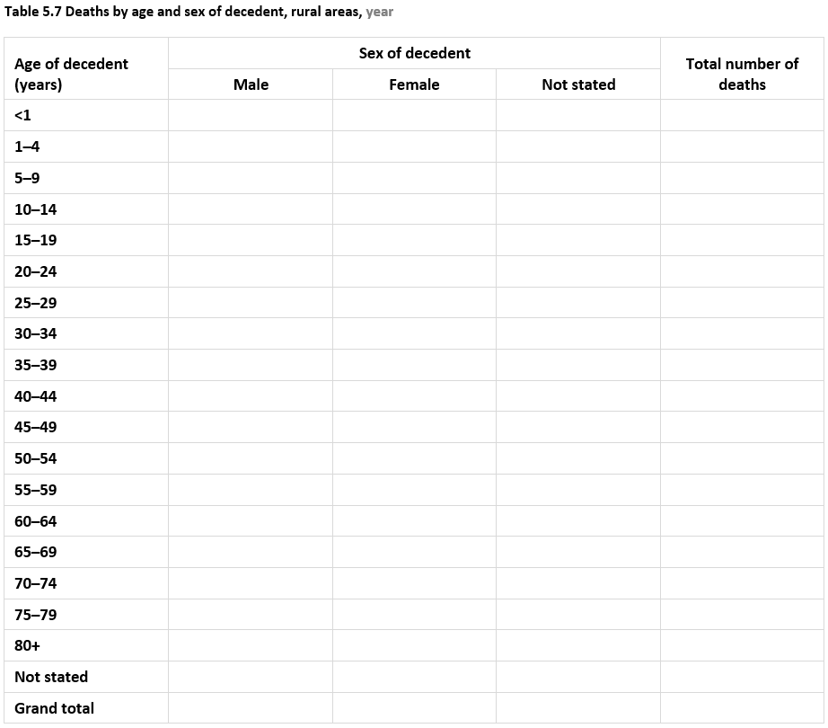{fig-alt="Template for Table 5.7." width=80% fig-align="left"}

---


### Table 5.8
*Crude death rate (CDR) by place of usual residence of decedent, year*    
<br>
Variables required:

```{r, results='asis'}
bullets <- variables |> 
  filter(id == "table_5_08") |> 
  distinct(variable_id, .keep_all = TRUE) |> 
  mutate(text = str_glue("{variable_id} ({variable_name}, {characteristic})")) |> 
  pull(text)
cat(paste('-', bullets), sep = '\n')
```

<br>
{fig-alt="Template for Table 5.8." width=80% fig-align="left"}

---


### Table 5.9 
*Infant and child mortality (deaths per 1,000 live births) by year of occurrence*     
<br>
Variables required:

```{r, results='asis'}
bullets <- variables |> 
  filter(id == "table_5_09") |> 
  distinct(variable_id, .keep_all = TRUE) |> 
  mutate(text = str_glue("{variable_id} ({variable_name}, {characteristic})")) |> 
  pull(text)
cat(paste('-', bullets), sep = '\n')
```

<br>
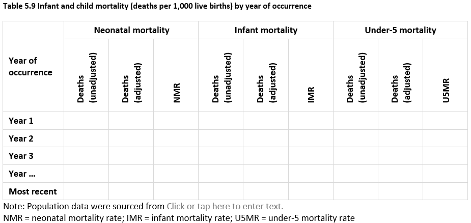{fig-alt="Template for Table 5.9." width=80% fig-align="left"}

---


### Table 5.10 
*Maternal mortality by year of occurrence*    
<br>
Variables required:

```{r, results='asis'}
bullets <- variables |> 
  filter(id == "table_5_10") |> 
  distinct(variable_id, .keep_all = TRUE) |> 
  mutate(text = str_glue("{variable_id} ({variable_name}, {characteristic})")) |> 
  pull(text)
cat(paste('-', bullets), sep = '\n')
```

<br>
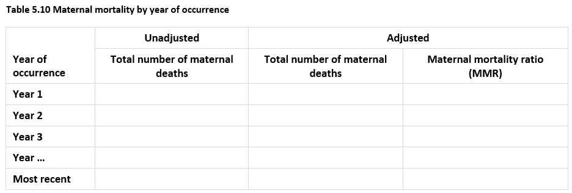{fig-alt="Template for Table 5.10." width=80% fig-align="left"}

---


### Table 5.11 
*Foetal deaths by year of occurrence and sex of foetus*    
<br>
Variables required:

```{r, results='asis'}
bullets <- variables |> 
  filter(id == "table_5_11") |> 
  distinct(variable_id, .keep_all = TRUE) |> 
  mutate(text = str_glue("{variable_id} ({variable_name}, {characteristic})")) |> 
  pull(text)
cat(paste('-', bullets), sep = '\n')
```

<br>
{fig-alt="Template for Table 5.11." width=80% fig-align="left"}

---


### Table 5.12 
*Foetal deaths by gestational age and birth weight of foetus, year*    
<br>
Variables required:

```{r, results='asis'}
bullets <- variables |> 
  filter(id == "table_5_12") |> 
  distinct(variable_id, .keep_all = TRUE) |> 
  mutate(text = str_glue("{variable_id} ({variable_name}, {characteristic})")) |> 
  pull(text)
cat(paste('-', bullets), sep = '\n')
```

<br>
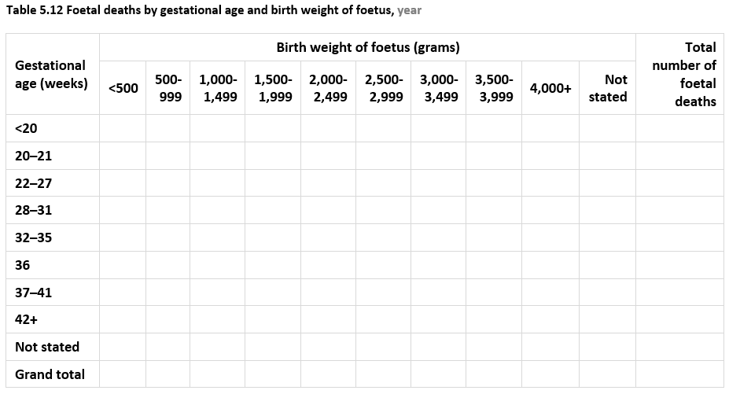{fig-alt="Template for Table 5.12." width=80% fig-align="left"}

---


## Cause of death

### Table 6.1 
*Leading causes of death by broad age group and sex, year*     
<br>
Variables required:

```{r, results='asis'}
bullets <- variables |> 
  filter(id == "table_6_01") |> 
  distinct(variable_id, .keep_all = TRUE) |> 
  mutate(text = str_glue("{variable_id} ({variable_name}, {characteristic})")) |> 
  pull(text)
cat(paste('-', bullets), sep = '\n')
```

<br>
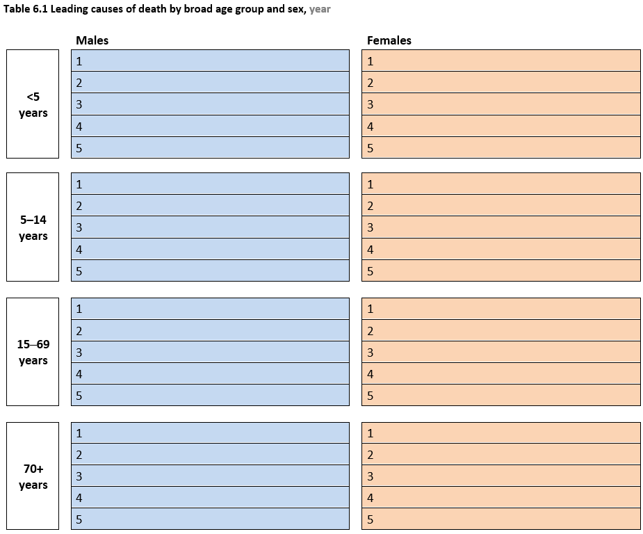{fig-alt="Template for Table 6.1." width=80% fig-align="left"}

---


### Table 6.2 
*Top 10 causes of death (all ages, both sexes), year*    
<br>
Variables required:

```{r, results='asis'}
bullets <- variables |> 
  filter(id == "table_6_02") |> 
  distinct(variable_id, .keep_all = TRUE) |> 
  mutate(text = str_glue("{variable_id} ({variable_name}, {characteristic})")) |> 
  pull(text)
cat(paste('-', bullets), sep = '\n')
```

<br>
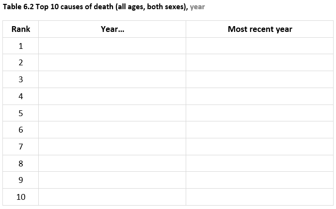{fig-alt="Template for Table 6.2." width=80% fig-align="left"}

---


### Table 6.3 
*Ten leading causes of death, males, year*    
<br>
Variables required:

```{r, results='asis'}
bullets <- variables |> 
  filter(id == "table_6_03") |> 
  distinct(variable_id, .keep_all = TRUE) |> 
  mutate(text = str_glue("{variable_id} ({variable_name}, {characteristic})")) |> 
  pull(text)
cat(paste('-', bullets), sep = '\n')
```

<br>
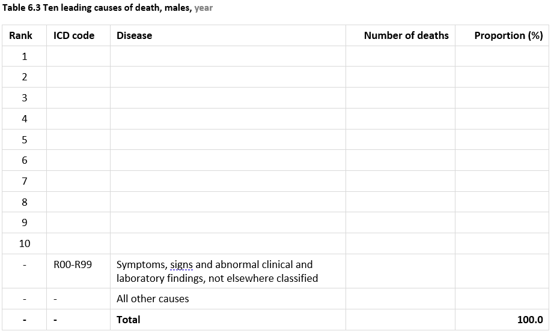{fig-alt="Template for Table 6.3." width=80% fig-align="left"}

---


### Table 6.4 
*Ten leading causes of death, females, year*    
<br>
Variables required:

```{r, results='asis'}
bullets <- variables |> 
  filter(id == "table_6_04") |> 
  distinct(variable_id, .keep_all = TRUE) |> 
  mutate(text = str_glue("{variable_id} ({variable_name}, {characteristic})")) |> 
  pull(text)
cat(paste('-', bullets), sep = '\n')
```

<br>
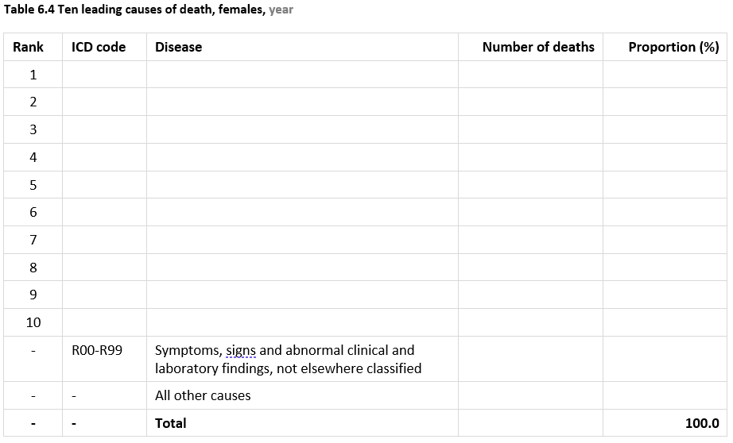{fig-alt="Template for Table 6.4." width=80% fig-align="left"}

---


### Table 6.5 
*Ten leading causes of death, infants and children (0–4 years, both sexes combined), year*     
<br>
Variables required:

```{r, results='asis'}
bullets <- variables |> 
  filter(id == "table_6_05") |> 
  distinct(variable_id, .keep_all = TRUE) |> 
  mutate(text = str_glue("{variable_id} ({variable_name}, {characteristic})")) |> 
  pull(text)
cat(paste('-', bullets), sep = '\n')
```

<br>
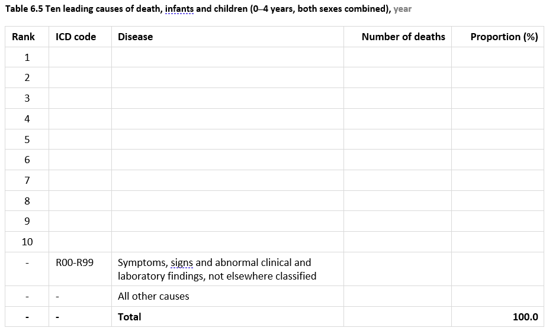{fig-alt="Template for Table 6.5." width=80% fig-align="left"}

---


### Table 6.6 
*Ten leading causes of death, children (5–14 years, both sexes combined), year*    
<br>
Variables required:

```{r, results='asis'}
bullets <- variables |> 
  filter(id == "table_6_06") |> 
  distinct(variable_id, .keep_all = TRUE) |> 
  mutate(text = str_glue("{variable_id} ({variable_name}, {characteristic})")) |> 
  pull(text)
cat(paste('-', bullets), sep = '\n')
```

<br>
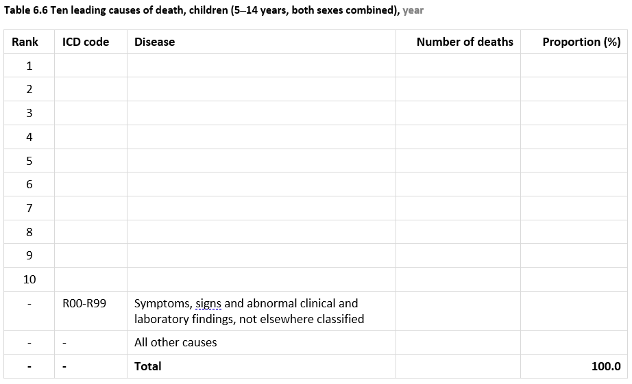{fig-alt="Template for Table 6.6." width=80% fig-align="left"}

---


### Table 6.7 
*Ten leading causes of death, adolescents and adults (15–69 years, males), year*    
<br>
Variables required:

```{r, results='asis'}
bullets <- variables |> 
  filter(id == "table_6_07") |> 
  distinct(variable_id, .keep_all = TRUE) |> 
  mutate(text = str_glue("{variable_id} ({variable_name}, {characteristic})")) |> 
  pull(text)
cat(paste('-', bullets), sep = '\n')
```

<br>
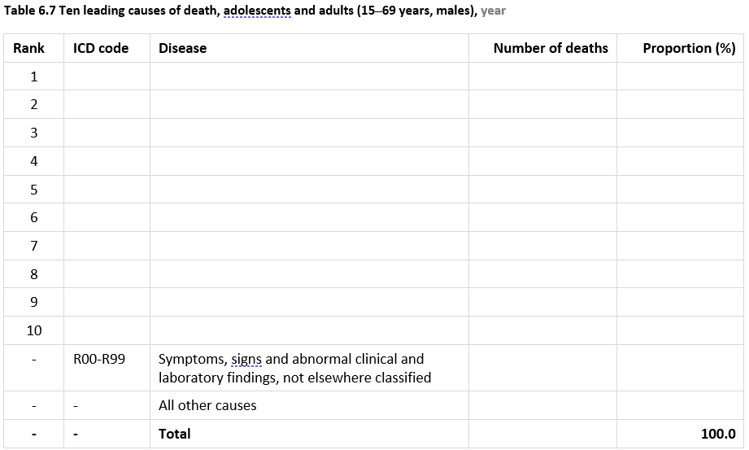{fig-alt="Template for Table 6.7." width=80% fig-align="left"}

---


### Table 6.8 
*Ten leading causes of death, adolescents and adults (15–69 years, females), year*    
<br>
Variables required:

```{r, results='asis'}
bullets <- variables |> 
  filter(id == "table_6_08") |> 
  distinct(variable_id, .keep_all = TRUE) |> 
  mutate(text = str_glue("{variable_id} ({variable_name}, {characteristic})")) |> 
  pull(text)
cat(paste('-', bullets), sep = '\n')
```

<br>
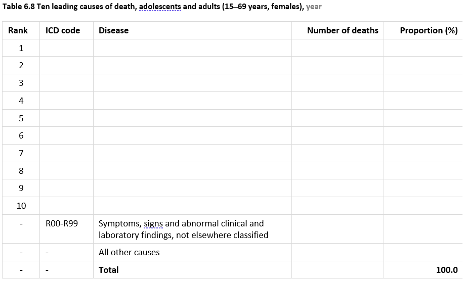{fig-alt="Template for Table 6.8." width=80% fig-align="left"}

---


### Table 6.9 
*Ten leading causes of death, older adults (70+ years, males), year*    
<br>
Variables required:

```{r, results='asis'}
bullets <- variables |> 
  filter(id == "table_6_09") |> 
  distinct(variable_id, .keep_all = TRUE) |> 
  mutate(text = str_glue("{variable_id} ({variable_name}, {characteristic})")) |> 
  pull(text)
cat(paste('-', bullets), sep = '\n')
```

<br>
{fig-alt="Template for Table 6.9." width=80% fig-align="left"}

---


### Table 6.10 
*Ten leading causes of death, older adults (70+ years, females), year*     
<br>
Variables required:

```{r, results='asis'}
bullets <- variables |> 
  filter(id == "table_6_10") |> 
  distinct(variable_id, .keep_all = TRUE) |> 
  mutate(text = str_glue("{variable_id} ({variable_name}, {characteristic})")) |> 
  pull(text)
cat(paste('-', bullets), sep = '\n')
```

<br>
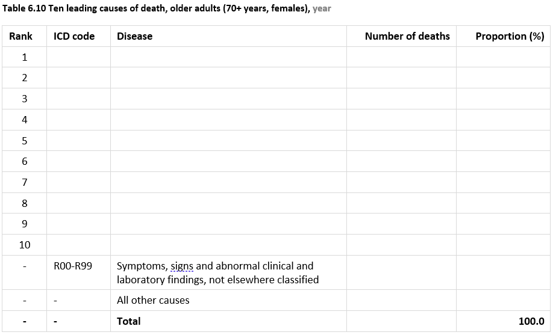{fig-alt="Template for Table 6.10." width=80% fig-align="left"}

---


## Marriage

### Table 7.1 
*Summary statistics on marriages and divorces by year of occurrence*     
<br>
Variables required:

```{r, results='asis'}
bullets <- variables |> 
  filter(id == "table_7_01") |> 
  distinct(variable_id, .keep_all = TRUE) |> 
  mutate(text = str_glue("{variable_id} ({variable_name}, {characteristic})")) |> 
  pull(text)
cat(paste('-', bullets), sep = '\n')
```

<br>
{fig-alt="Template for Table 7.1." width=80% fig-align="left"}

---


### Table 7.2 
*Marriages by place of usual residence of groom and age of bride and groom, urban areas, year*    
<br>
Variables required:

```{r, results='asis'}
bullets <- variables |> 
  filter(id == "table_7_02") |> 
  distinct(variable_id, .keep_all = TRUE) |> 
  mutate(text = str_glue("{variable_id} ({variable_name}, {characteristic})")) |> 
  pull(text)
cat(paste('-', bullets), sep = '\n')
```

<br>
{fig-alt="Template for Table 7.2." width=80% fig-align="left"}

---


### Table 7.3 
*Marriages by place of usual residence of groom and age of bride and groom, rural areas, year*    
<br>
Variables required:

```{r, results='asis'}
bullets <- variables |> 
  filter(id == "table_7_03") |> 
  distinct(variable_id, .keep_all = TRUE) |> 
  mutate(text = str_glue("{variable_id} ({variable_name}, {characteristic})")) |> 
  pull(text)
cat(paste('-', bullets), sep = '\n')
```

<br>
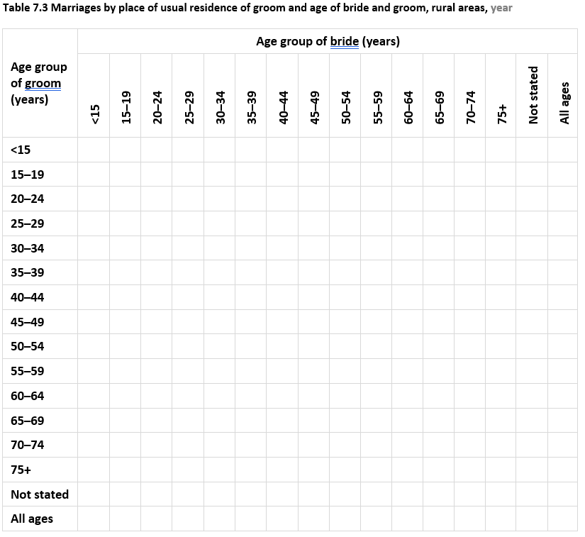{fig-alt="Template for Table 7.3." width=80% fig-align="left"}

---


### Table 7.4 
*Marriages by age of groom and previous marital status, year*    
<br>
Variables required:

```{r, results='asis'}
bullets <- variables |> 
  filter(id == "table_7_04") |> 
  distinct(variable_id, .keep_all = TRUE) |> 
  mutate(text = str_glue("{variable_id} ({variable_name}, {characteristic})")) |> 
  pull(text)
cat(paste('-', bullets), sep = '\n')
```

<br>
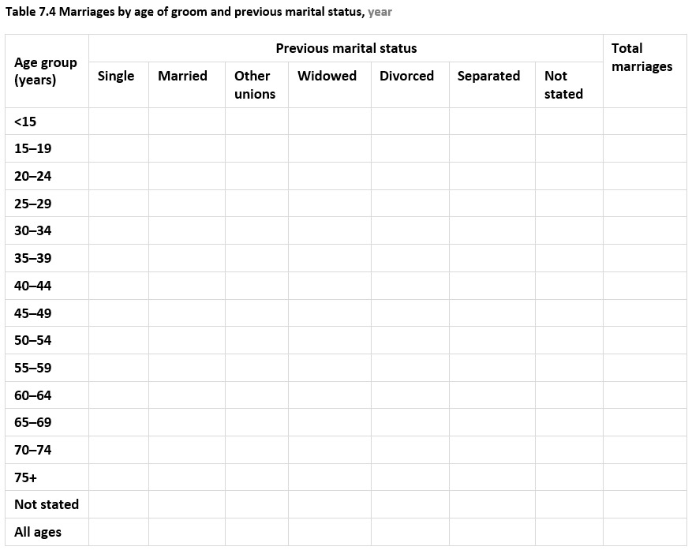{fig-alt="Template for Table 7.4." width=80% fig-align="left"}

---


### Table 7.5 
*Marriages by age of bride and previous marital status, year*    
<br>
Variables required:

```{r, results='asis'}
bullets <- variables |> 
  filter(id == "table_7_05") |> 
  distinct(variable_id, .keep_all = TRUE) |> 
  mutate(text = str_glue("{variable_id} ({variable_name}, {characteristic})")) |> 
  pull(text)
cat(paste('-', bullets), sep = '\n')
```

<br>
{fig-alt="Template for Table 7.5." width=80% fig-align="left"}

---


## Divorce

### Table 7.6 
*Divorces by age of husband and age of wife, year*    
<br>
Variables required:

```{r, results='asis'}
bullets <- variables |> 
  filter(id == "table_7_06") |> 
  distinct(variable_id, .keep_all = TRUE) |> 
  mutate(text = str_glue("{variable_id} ({variable_name}, {characteristic})")) |> 
  pull(text)
cat(paste('-', bullets), sep = '\n')
```

<br>
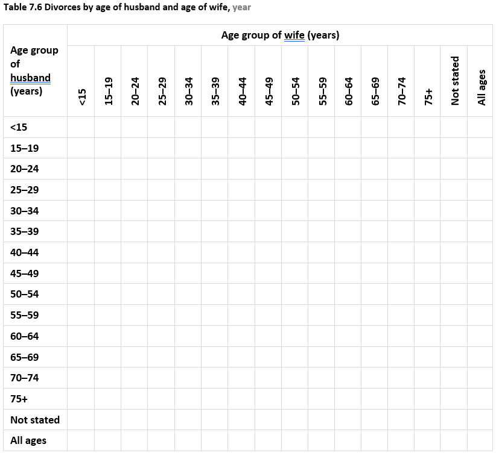{fig-alt="Template for Table 7.6." width=80% fig-align="left"}

---


### Table 7.7 
*Divorces by duration of marriage and age of husband, year*    
<br>
Variables required:

```{r, results='asis'}
bullets <- variables |> 
  filter(id == "table_7_07") |> 
  distinct(variable_id, .keep_all = TRUE) |> 
  mutate(text = str_glue("{variable_id} ({variable_name}, {characteristic})")) |> 
  pull(text)
cat(paste('-', bullets), sep = '\n')
```

<br>
{fig-alt="Template for Table 7.7." width=80% fig-align="left"}

---


### Table 7.8 
*Divorces by duration of marriage and age of wife, year*   
<br>
Variables required:

```{r, results='asis'}
bullets <- variables |> 
  filter(id == "table_7_08") |> 
  distinct(variable_id, .keep_all = TRUE) |> 
  mutate(text = str_glue("{variable_id} ({variable_name}, {characteristic})")) |> 
  pull(text)
cat(paste('-', bullets), sep = '\n')
```

<br>
{fig-alt="Template for Table 7.8." width=80% fig-align="left"}

---


### Table 7.9 
*Divorces by duration of marriage and number of dependent children, year*   
<br>
Variables required:

```{r, results='asis'}
bullets <- variables |> 
  filter(id == "table_7_09") |> 
  distinct(variable_id, .keep_all = TRUE) |> 
  mutate(text = str_glue("{variable_id} ({variable_name}, {characteristic})")) |> 
  pull(text)
cat(paste('-', bullets), sep = '\n')
```

<br>
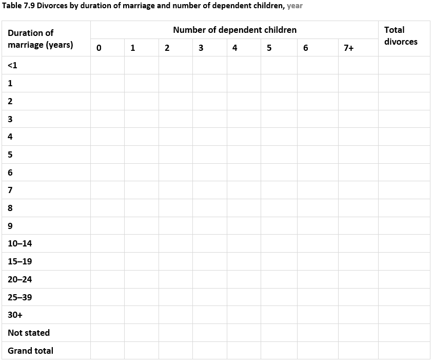{fig-alt="Template for Table 7.9." width=80% fig-align="left"}

---


## Summary tables

### Table 8.1 
*Live births, deaths, and infant and child deaths by year of occurrence*    
<br>
Variables required:

```{r, results='asis'}
bullets <- variables |> 
  filter(id == "table_8_01") |> 
  distinct(variable_id, .keep_all = TRUE) |> 
  mutate(text = str_glue("{variable_id} ({variable_name}, {characteristic})")) |> 
  pull(text)
cat(paste('-', bullets), sep = '\n')
```

<br>
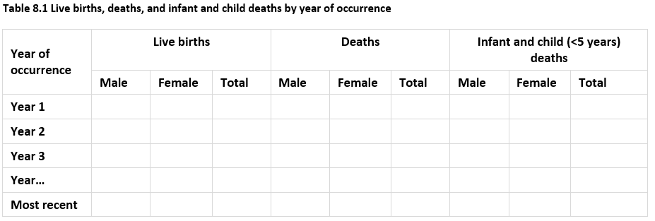{fig-alt="Template for Table 8.1." width=80% fig-align="left"}

---


### Table 8.2 
*Live births, deaths, and infant and child deaths by place of usual residence of mother (births) or decedent (deaths), year*    
<br>
Variables required:

```{r, results='asis'}
bullets <- variables |> 
  filter(id == "table_8_02") |> 
  distinct(variable_id, .keep_all = TRUE) |> 
  mutate(text = str_glue("{variable_id} ({variable_name}, {characteristic})")) |> 
  pull(text)
cat(paste('-', bullets), sep = '\n')
```

<br>
{fig-alt="Template for Table 8.2." width=80% fig-align="left"}

---


### Table 8.3 
*Fertility and mortality indicators by year of occurrence*    
<br>
Variables required:

```{r, results='asis'}
bullets <- variables |> 
  filter(id == "table_8_03") |> 
  distinct(variable_id, .keep_all = TRUE) |> 
  mutate(text = str_glue("{variable_id} ({variable_name}, {characteristic})")) |> 
  pull(text)
cat(paste('-', bullets), sep = '\n')
```

<br>
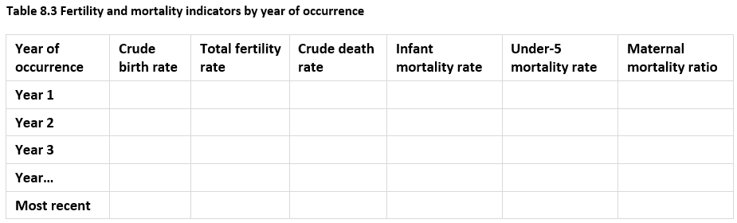{fig-alt="Template for Table 8.3." width=80% fig-align="left"}

---


### Table 8.4 
*Fertility and mortality indicators by place of usual residence of mother (births and infant deaths) or decedent (other deaths), year*    
<br>
Variables required:

```{r, results='asis'}
bullets <- variables |> 
  filter(id == "table_8_04") |> 
  distinct(variable_id, .keep_all = TRUE) |> 
  mutate(text = str_glue("{variable_id} ({variable_name}, {characteristic})")) |> 
  pull(text)
cat(paste('-', bullets), sep = '\n')
```

<br>
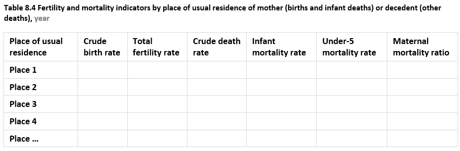{fig-alt="Template for Table 8.4." width=80% fig-align="left"}

---


### Table 8.5 
*Marriage and divorce indicators by year of occurrence*    
<br>
Variables required:

```{r, results='asis'}
bullets <- variables |> 
  filter(id == "table_8_05") |> 
  distinct(variable_id, .keep_all = TRUE) |> 
  mutate(text = str_glue("{variable_id} ({variable_name}, {characteristic})")) |> 
  pull(text)
cat(paste('-', bullets), sep = '\n')
```

<br>
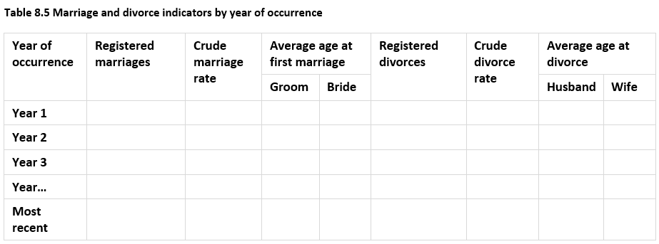{fig-alt="Template for Table 8.5." width=80% fig-align="left"}
